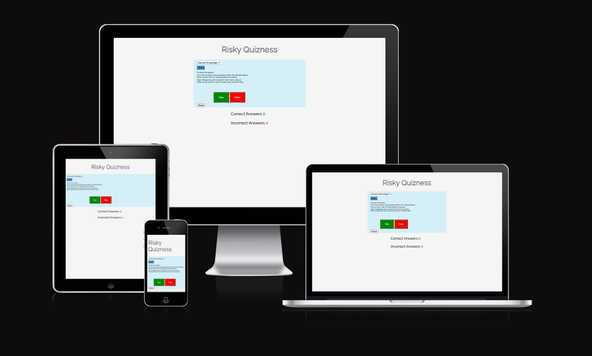
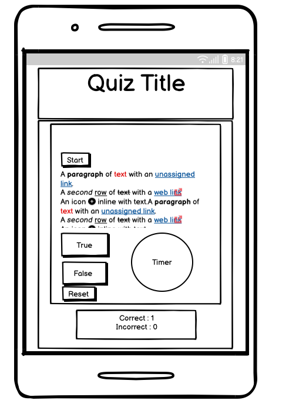
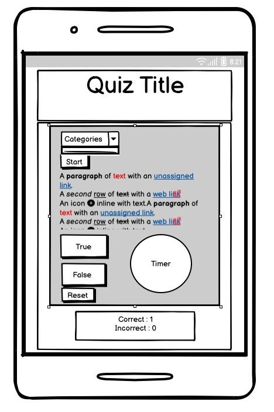
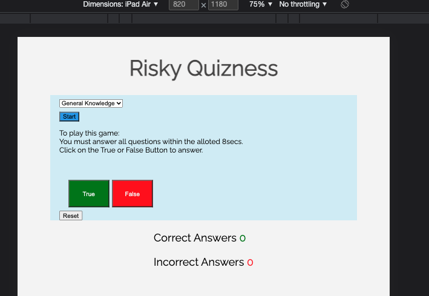
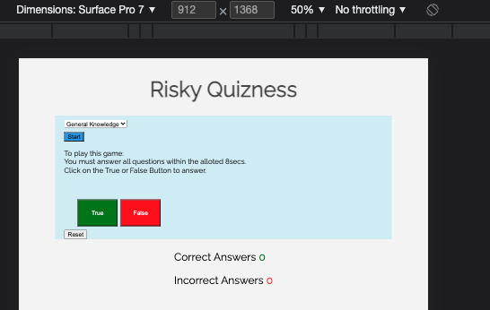
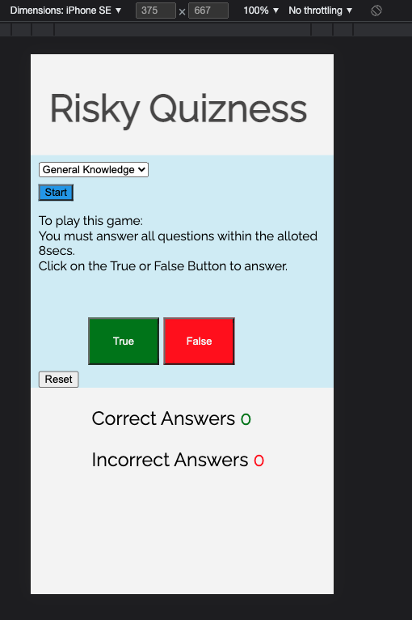

<h1 align="center">Risky Quizness Website</h1>

This is a website designed to provide users with a fun quiz game, that allows them to test their knowledge over a range of categories.
It has been designed to be responsive and accesible over a range of different devices.

## USER EXPERIENCE 

- ### First Time Visitor Goals
    1. As a first time visitor, I want to quickly and easily be able to see what the quiz is about. 
    2. As a first time visitor, I want to be able to be able to navigate the site with ease and see what functions are available.  
    3. As a first time visitor, I want to have a choice of categories to be quized on. 
  

- ### Returning Visitor Goals  
    1. As a returning visitor, I want to be able to try some of the other quiz categories that I didn't try before. 
   2. As a returning visitor, I want to be able to retake the quiz and see if I can better my previous scores.

- ### Frequent User Goals
    1. As a frequent visitor, I want to check if there are any newly added categories and questions to the site.

- # DESIGN 
    
    - ### Colour Scheme
		The page makes use of a simple yet effective white and silvery blue color scheme. This provides a visually pleasing response for users as the colors contrast well with eachother and attracts users attention to the important areas of the page very naturally, without being to loud and overstimulating. The colours provide a clean clear finish for maximum user enjoyment. The true False answer buttons for the quiz use bright colors to draw user attention. The green and red colors provide a familiar feel and make the buttons very intiutive as to what the will be used for. The page heading has a lighter color giving it a softer feel while also making the questions in black font pop more on the page. Making it very clear and easy for the user to see and read the questions.
### 	Typography
		The Raleway font is used throughout the site. With sans-serif as a backup incase for any reason the raleway font does not load. Raleway is a clean crisp font allowing great readability and a positive user experience throughout. It is a commonly used font and so gives users a sense of familiarity, helping them to trust the sight and feel more comfortable using the sight and recommending it to friends. 

- # Wireframes 

		1. Home page wireframe. 

		
		2. Mobile wireframe.

		
		
- # Features 

 Tested over a range of device sizes. Responsive over all device sizes. 
 Buttons are interactive on the site allowing for easy identification of their function and when one is hovering over them. 
 
 - # Technologies Used 
 	## Languages Used
	- HTML5
	- CSS3
	- JavaScript

	## Frameworks, Libraries & Programs Used
		1. Balsamiq - was used to crete the wireframes for the initial planning of the layout of the project. 
		2. Github - was used to store the projects code after being pushed from Gitpod
		3. Gitpod - was used to compile the project and write all the html, css and javascript.
		4. GoogleFonts - was used for the text content of the entire quiz. The Raleway font was used. 
		5. Am I responsive - was used to demonstrate the responsivity of the site across a variety of devices. 
		6. Stackoverflow - was used to research some of the javascript functions. The timer function in particular was adapted from a timer found in one of the examples. 
		7. W3Schools- was also used in the research of some the javascript functions.

# Testing 

   ### Jshint
		1. https://jshint.com/ - Results
		Jshint was used to validate the JavaScript code. The code returned with a few warnings for the variable types: 'let' is available in ES6 (use 'esversion: 6') or Mozilla JS extensions (use moz). This was deemed to be acceptable as the quiz still functioned across multiple devices and browser types.

   ### Jigsaw
    - Validated using jigsaw validator with no errors found. 
    - There were 3 warnings found for using zoom, as it is a vendor extension. I am happy to use it however as I believe it creates a positive user experience by zooming in the menu and true false answer buttons.
    -Below is the link to the css validator.
    
 http://jigsaw.w3.org/css-validator/validator$link
or
http://jigsaw.w3.org/css-validator/check/referer (for HTML/XML document only)

   ### W3C Validator
   - https://validator.w3.org/nu/#textarea	-Results
   - HTML code was passed through the html validator and returned with no warnings or errors. 
  
  # Testing User Stories from User Experience Section
  	### First Time Visitor Goals
		1. As a first time visitor, I want to quickly and easily be able to see what the quiz is about. 
			a. Upon enetering the site users are greated automatically with the quiz face. There is a clear heading with the title of the quiz, "Risky Quizness" which while being a play on words gives users a indication of what the quiz is.
			b. Users are then drawn straight to the menu and start button giving them the ability to determine what quiz categories there are any choose what quiz they would like to choose. 
    2. As a first time visitor, I want to be able to be able to navigate the site with ease and see what functions are available.  
			a. On site loading the quiz instructions are displayed before the quiz is selected allowing users to become familiar with the workings of the quiz before they start. The instructions remain in place during the quiz for easy referal. The font size is however considerably smaller and a lighter shade then the quiz questions so as not to distract the user from the main question and purpose of the site. 
    3. As a first time visitor, I want to have a choice of categories to be quized on. 
		a. this is made possible through the menu at the top of the quiz area. Which is easily findable and familiar to users.The arrow display at the end of the menu provides another visual que that there is a menu and their is a category displayed before even opening the menu which also aids in the user experience. 
	### Returning Visitor Goals
	 1. As a returning visitor, I want to be able to try some of the other quiz categories that I didn't try before. 
	 	a. With having one quiz page and interface returning users are easily able to return to the menu to choose from other quiz categories and test their knowledge in a variety of categories. 
   2. As a returning visitor, I want to be able to retake the quiz and see if I can better my previous scores.
   		b. having a visual que with the scores below the questions gives users a manner to track how while they are doing and upon returning to the site they will be able to see clearly what their score is as they progress through the quiz as well as have it displayed at the end of the quiz. There is also a reset button below that zeros the scores and allows users another chance there and then to try beat their score for the day or try out a different category and see how they do. 
	### Frequent Visitor Goals 
	1. As a frequent visitor, I want to check if there are any newly added categories and questions to the site.
		a. This can be achieved through the menu which displays all the quiz categories. Future development of the quiz site could start to include a signup form or a newsletter or social media pages for these frequentvisitors. 
		
	# Future Ideas and development. 
	
		1. As mentioned briefely above, having a signup form users to signup to that could give users access to newsletters or updates on the quiz. Events like quiz evenings or online meet-ups for live quiz games could also be achieved and arranged from details obtained in sigup and username forms.
		2. creating a username and password could allow users to pause progress and come back later. Users could also log their results to a leaderboard to be able to compete with other quiz takers. 
		3. Social media pages and links to those pages could also be created allowing quiz takers to connect with other via social media platforms and create a bigger user environment around the quiz. 
		4. new quiz categories and using abovementioned newsletters and social media platforms these new quizes could be launched. 
		5. Create more questions for the current quiz categories so frequent and return users are kept engaged an cheallenged. 
		6. Onc e more questions have been created individual categories can also be split into different difficulty levels for the benefit of other a wider range of user abilities.
		
		
# Further Testing
		1. The site was tested on Google Chrome and Safari browsers.
		2.The website was viewed on a variety of devices such as Desktop, Laptop, 			iPhone7, iPhone 8 & iPhoneX.
		3.A large amount of testing was done to ensure that all quizes were displaying correctly and the correct and incorrect answer tallys were displaying and linking to the questions correctly.
		4.Friends and family members were asked to review the site and documentation 		to point out any bugs and/or user experience issues.
   
  # Known Bugs
  1.	If the users doesn't select an answer the loop for the check answer doesn't continue until it detects an answer submitted so a new question will apear but the check answer function will still be looking for the answer to the previous question. In the instructions users are told they have to answer all questions. 
2.		The reset button needs to be used to reset total score before moving on to the next category or trying to replay the same category. During development I added the reset function to the run game loop so that it automatically reset after game however this didn't allow users the chance to review their score as it was removed as soon as the loop finished. As such I decided it better to leave the reset button to be manually clicked after the quiz. 
3. If start button is clicked before the end of the current quiz depending on internet speed there have been some issues with restarting the game. Without reselecting a category clicking start will also run the default quiz which is sports quiz. 

# Deployment

The project was deployed to Github Pages. Using the master branch source method which gives me a live link to the page. 

#Credits 

### Code 
W3Schools was used for researching and finding manners and methods of writting some of the javascript functions.

Stackoverflow - was used to research some of the javascript functions. The timer function in particular was adapted from a timer found in one of the examples. The code was addapted and changed to fit more appropriately into my quiz.

CSS tricks - the template for the guide to flexbox was used to remember how to style my divs in css. 

### Media
All media was created by me from screenshots. 

###Acknowledgements 

Constant help and support from my mentor helped me link the gap to some of my functions and how to implement them.
